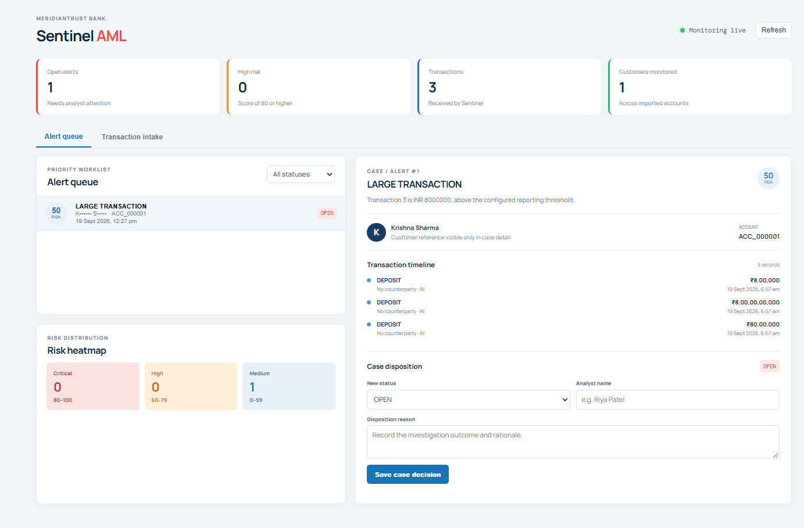
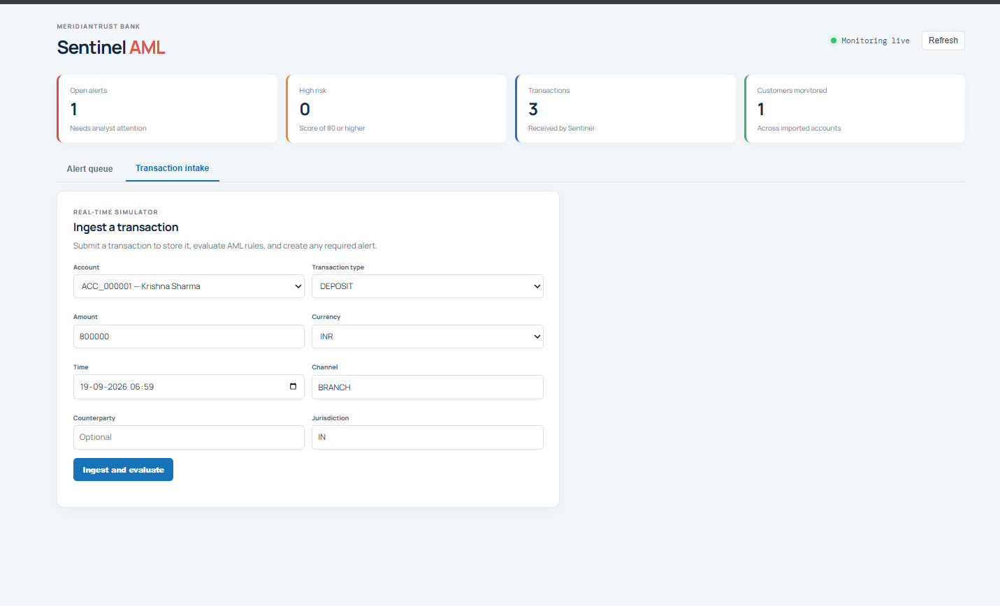
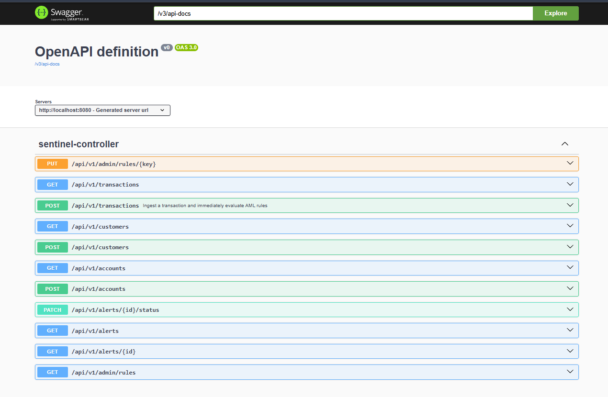
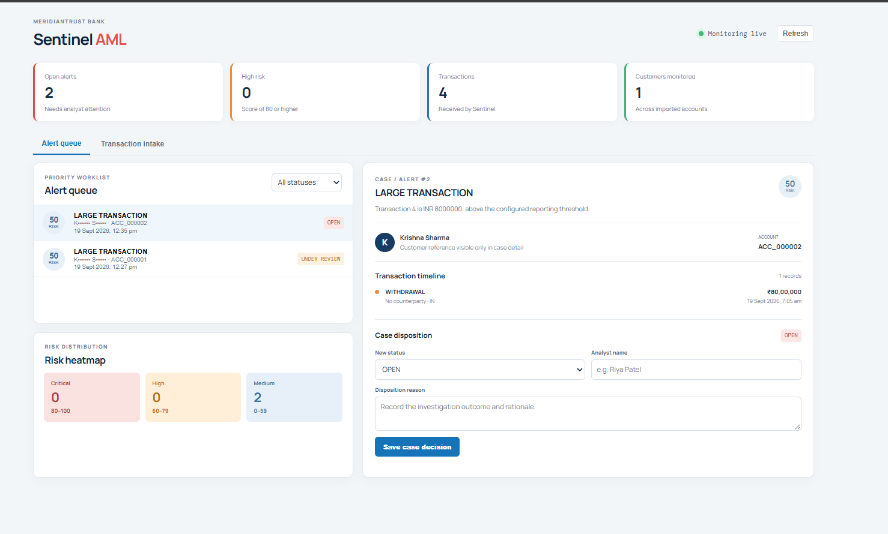

# Sentinel AML — Real-Time Money Laundering Detection

Sentinel AML is a banking transaction-monitoring prototype. It receives a transaction, persists it, evaluates explainable anti-money-laundering (AML) rules, creates a risk-ranked alert when needed, and gives a compliance analyst a workflow to review and dispose of the alert.

## Product preview

### Alert investigation workspace

The analyst sees a prioritised alert queue, risk distribution, evidence timeline, and case-disposition controls in one view.



### Real-time transaction intake

Transactions can be submitted through the dashboard to demonstrate immediate validation, storage, and AML-rule evaluation.



### API documentation

The Spring Boot backend publishes its versioned REST endpoints through OpenAPI/Swagger.



### Analyst case disposition

An analyst records the case status, identity, and investigation rationale; the alert remains preserved for auditability.



## Business flow

```text
Customer / account data in PostgreSQL
                ↓
New transaction arrives at POST /api/v1/transactions
                ↓
Validate request and confirm the account exists
                ↓
Normalize the amount to INR and save the transaction
                ↓
Detection engine evaluates AML rules
                ↓
Create or update one alert with risk score, evidence, and explanation
                ↓
React analyst dashboard shows the alert and transaction timeline
                ↓
Analyst records a status, name, and disposition reason
```

For example, three deposits just below the reporting threshold from the same account in 24 hours cause a **Structuring** alert. The analyst sees why Sentinel flagged it and the source transaction IDs.

## Backend architecture

The backend follows a layered Spring Boot architecture:

```text
React / Swagger / external producer
              ↓ HTTP + JSON
Controller
              ↓
Service layer
  ├── DetectionService: evaluates AML rules and creates/updates alerts
  └── RuleSettings: reads live rule configuration from PostgreSQL
              ↓
Repository layer (Spring Data JPA)
              ↓
PostgreSQL
```

### Main domain entities

| Entity | Purpose |
|---|---|
| `Customer` | Synthetic KYC identity, customer reference, and risk rating. |
| `Account` | A customer’s bank account, type, and currency. |
| `AmlTransaction` | An incoming banking transaction, including original and INR-normalized amount. |
| `Alert` | An explainable AML finding: rule, score, evidence, status, analyst, and disposition. |
| `RuleConfig` | Database-managed settings for existing rules: thresholds, lists, weights, and enablement. |

Relationship summary:

```text
Customer 1 ── * Account 1 ── * AmlTransaction
Customer 1 ── * Alert   * ── 1 Account
RuleConfig controls how the detection engine evaluates transactions
```

### Transaction ingestion and detection

The core endpoint is:

```text
POST /api/v1/transactions
```

When called, the backend:

1. Validates mandatory fields such as account ID, amount, transaction type, currency, and timestamp.
2. Confirms that the account exists; invalid accounts return `404 Not Found`.
3. Converts supported USD/EUR/INR amounts into the INR comparison value.
4. Stores the transaction in `aml_transactions`.
5. Runs `DetectionService` in the same transaction.
6. Creates or aggregates an alert in `aml_alerts`.

Alert aggregation prevents redundant open alerts for the same account and rule. Rather than creating fifty alerts for one ongoing pattern, Sentinel updates the existing alert’s evidence and explanation.

### Implemented AML rules

| Rule | Default behavior | Default risk score |
|---|---|---:|
| Large transaction | Flags a normalized INR amount at or above INR 830,000. | 50 |
| Structuring / smurfing | Flags at least three INR 747,000–829,999 transactions from one account in a 24-hour window. | 85 |
| High-risk jurisdiction | Flags a transaction involving a configured high-risk jurisdiction, initially `IR`, `KP`, or `SY`. | 90 |

Each alert stores a human-readable explanation and the evidence transaction IDs, so an analyst can understand *why* it was created.

### Rule configuration approach

The rule engine is intentionally configurable without a redeployment. Rule settings live in the `rule_config` table and are accessed with:

```text
GET /api/v1/admin/rules
PUT /api/v1/admin/rules/{ruleKey}
```

An administrator can enable/disable an existing rule, change its risk weight, change the large-transaction threshold, change structuring amount bands/count, or edit the high-risk jurisdiction list. A brand-new detection algorithm still requires a Java implementation; the settings configure the rules that exist.

### Database, migrations, and seed data

PostgreSQL is the application database. The schema is owned by **Flyway**, not Hibernate:

```properties
spring.jpa.hibernate.ddl-auto=validate
spring.flyway.enabled=true
```

On first startup, Flyway runs the initial versioned migration, creating:

```text
customer, account, aml_transactions, aml_alerts, rule_config
```

After migrations complete, the seed-data importer loads the supplied synthetic customer and account CSV data. It uses the CSV customer/account references to avoid duplicate inserts, so restarts are safe.

## REST API summary

| Endpoint | Purpose |
|---|---|
| `POST /api/v1/customers` | Create a customer. |
| `GET /api/v1/customers` | List imported/customers. |
| `POST /api/v1/accounts` | Create an account for a customer. |
| `GET /api/v1/accounts` | List accounts. |
| `POST /api/v1/transactions` | Ingest and immediately evaluate a transaction. |
| `GET /api/v1/transactions` | List transactions. |
| `GET /api/v1/alerts` | List alerts sorted by descending risk score. |
| `GET /api/v1/alerts/{id}` | Get alert/case detail. |
| `PATCH /api/v1/alerts/{id}/status` | Record analyst disposition; alerts are never deleted. |
| `GET/PUT /api/v1/admin/rules` | Read or configure existing AML rules. |

## React dashboard

The frontend is a simple analyst workspace, not a second business-logic layer. It calls the backend APIs through Vite’s `/api` proxy.

It provides:

- **Alert queue:** Alerts are sorted by score and filterable by status.
- **Risk heatmap:** Displays the count of critical, high, and medium risks.
- **Customer transaction timeline:** Shows all transactions for the selected alert’s account.
- **Case detail/disposition:** Shows explanation and evidence; an analyst can move the alert through `OPEN`, `UNDER_REVIEW`, `ESCALATED`, `CLOSED_FALSE_POSITIVE`, or `REPORTED`.
- **Transaction intake:** A demo screen to submit a transaction and see the backend evaluate it immediately.

## Testing

The backend test suite verifies the detection service. A successful Maven test run reports `BUILD SUCCESS`.

## Current MVP scope and next steps

The current project demonstrates the real-time, explainable rule-based AML workflow. High-value extensions include rapid movement of funds, behavioural deviation, configurable exchange-rate storage, user authentication/role-based access, an immutable audit-log table, bulk transaction CSV import, and case grouping for multiple alerts.
